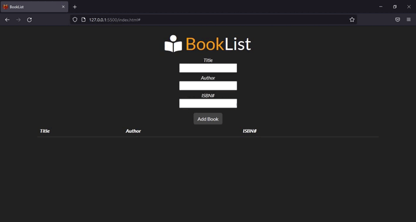

# 📕 BookList

### As an upadate of my learning process, I decided to make my this booklist by my own, using what I've already learned and also reading some documentation. I trained constructor function, local storage, DOM manipulation.🚀

#

### Access it here 🔗[BookList]()

#

